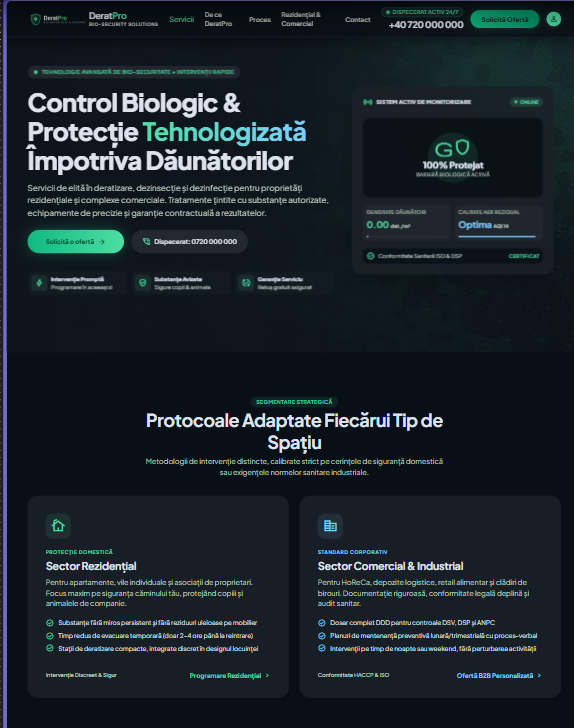
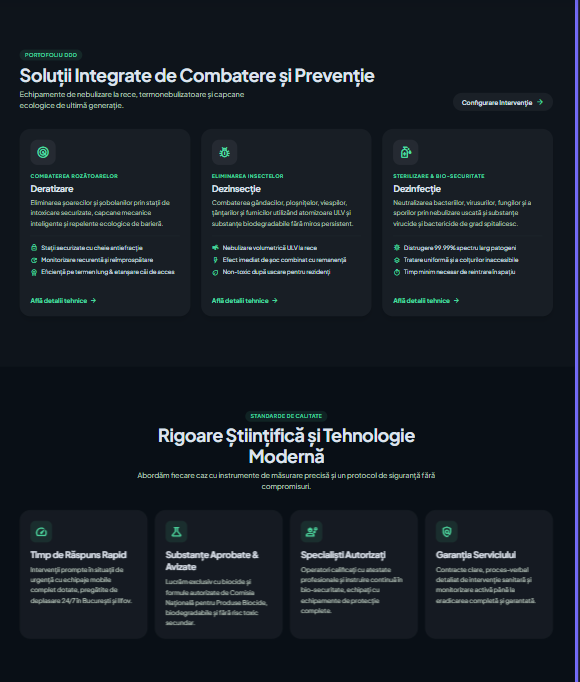
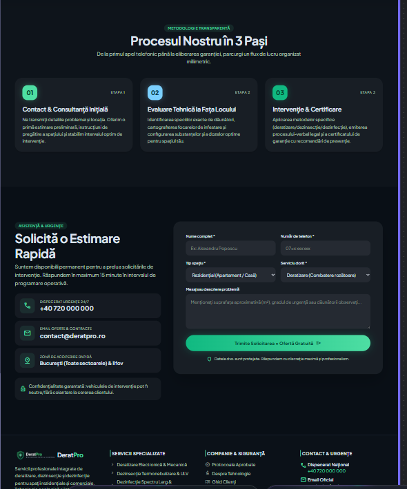

# DeratPro

Landing page pentru o firmă de deratizare, dezinsecție și dezinfecție. Firma e inventată, așa că pe site nu găsești statistici, certificări sau recenzii, iar telefonul și emailul (`+40 700 000 000`, `contact@deratpro.example`) sunt de test.

Are cinci secțiuni (hero, servicii, avantaje, proces, contact), o scenă Three.js în hero și un formular de contact cu validare. Site-ul e în română și în engleză, cu un buton RO / EN în meniu. Am vrut să arate ca un site pe care o firmă mică l-ar putea folosi chiar mâine.

Demo: https://deratpro-two.vercel.app

## Rulare locală

Ai nevoie de Node.js 20.9 sau mai nou.

```bash
npm install
npm run dev
```

Apoi deschizi http://localhost:3000.

```bash
npm run build     # build de producție
npm run start     # rulează build-ul
npm run lint
npx tsc --noEmit  # verificare de tipuri
```

## Stack

Next.js 16 (App Router), React 19 și TypeScript, cu Tailwind CSS 4 pentru stiluri. Scena 3D e făcută cu Three.js prin @react-three/fiber, animațiile la scroll și meniul de pe mobil cu Motion. Iconițele sunt din Lucide, fontul e Geist.

N-am vrut dependențe de care nu am nevoie. Formularul, de exemplu, nu folosește nicio librărie de formulare. Toată validarea are vreo 60 de rânduri, iar așa e mai ușor de citit.

## Design

Direcția vizuală am stabilit-o la început lucrând cu Claude, pornind de la brief-ul din [`docs/design-prompt.md`](docs/design-prompt.md): fundal închis, accent verde-lime, carduri rotunjite, cele cinci secțiuni.

După prima versiune a site-ului am dat același prompt și în Google Stitch, ca să văd cum îl interpretează un tool de design dedicat și dacă îmi scapă ceva. Asta a ieșit:

<p>
  
  
  
</p>

Structura seamănă mult cu ce aveam: carduri de servicii cu listă de beneficii, patru avantaje pe un rând, pași numerotați 01–03, contactul împărțit în date de contact și formular. Mi-a confirmat că direcția era bună. Totuși, am lăsat deoparte destul de mult:

- Stitch a pus pe pagină exact ce promptul interzicea: „Conformitate HACCP & ISO”, „99.99% spectru larg patogeni”, „răspundem în maximum 15 minute”, avize de la instituții reale. Pentru o firmă inventată astea ar fi afirmații false, așa că nu le-am preluat.
- Titlurile („Control Biologic & Protecție Tehnologizată”, „Rigoare Științifică și Tehnologie Modernă”) sună impresionant, dar nu spun simplu ce face firma. Am rămas la texte directe.
- În hero a pus un panou fals de „monitorizare” cu cifre inventate. Eu am vrut acolo animația 3D, care arată ideea de protecție fără date false.
- A adăugat o secțiune separată pentru rezidențial și comercial. Am vrut să rămân la cinci secțiuni, așa că distincția apare doar în texte.
- Totul e pe același fundal închis. Eu am pus secțiunea „De ce DeratPro” pe fundal deschis, pentru că toată pagina pe negru obosea ochii la scroll. Pe fundalul ăla butonul e negru, fiindcă verdele nu avea destul contrast.

Culorile, umbrele și colțurile sunt definite o singură dată, ca tokens în `globals.css`. Altfel ajungeam cu trei nuanțe de gri aproape identice prin componente.

Pe mobil scena 3D stă sub text, nu în spatele lui. Altfel titlul se citea greu.

Logo-ul e un scut cu un gândac, desenat de mine în SVG. Am încercat și cu un șoarece, și cu o țintă, dar la mărimea unui favicon doar gândacul se mai înțelegea.

## Scena 3D

În hero e o casă desenată din linii, sub o cupolă transparentă. Din afară vin particule portocalii, adică dăunătorii. Când lovesc cupola se fac verzi, ricoșează și dispar, iar pe cupolă apare o undă acolo unde au lovit. Cu mouse-ul le poți împinge.

Prima versiune era un scut abstract cu particule în jur. Arăta bine, dar nu înțelegeai ce e. Casa sub cupolă arată direct ce face firma, fără gândaci sau șobolani pe ecran.

La performanță am avut grijă la câteva lucruri. Scena se încarcă separat, cu `next/dynamic` și `ssr: false`, ca restul paginii să nu aștepte după Three.js. Toate particulele sunt un singur obiect `Points` cu un shader scris de mână, deci un singur draw call. În `useFrame` modific array-uri alocate o singură dată, fără obiecte noi la fiecare cadru.

Când hero-ul iese din ecran, scena se oprește. Pe telefon sunt 220 de particule în loc de 560 și rezoluția e limitată. Dacă ai „reduce motion” activat în sistem, vezi doar o imagine statică.

## Formularul

Are nume, telefon, mesaj și două câmpuri opționale, email și serviciul dorit.

Numele trebuie să aibă măcar 2 caractere și poate avea diacritice, cratimă sau apostrof. La telefon merg formatele obișnuite din România (`0722 123 456`, `+40 722 123 456`, fix `0256…`) și numerele internaționale cu `+`, iar spațiile și cratimele nu contează. Mesajul are între 10 și 1000 de caractere.

Erorile apar când ieși dintr-un câmp sau când apeși pe trimite, nu în timp ce scrii. Nu-mi place să văd „câmp invalid” după prima literă. Dacă ceva e greșit la trimitere, focusul sare la primul câmp cu problemă.

Backend nu există, așa că trimiterea e simulată: un mic delay, apoi mesajul de confirmare. Validarea e separată de componentă, în `src/lib/validation.ts`, ca să poată fi folosită și pe server. Următorul pas ar fi un Server Action care verifică din nou datele și trimite emailul.

În secțiunea de contact, linkul de email deschide un mesaj nou cu subiectul și un mic șablon deja completate.

## Română și engleză

Româna e la `/`, engleza la `/en`. Butonul RO / EN din meniu e un link simplu între cele două adrese și te duce în aceeași secțiune în care erai.

Am ales limba în URL în loc de un buton care schimbă textul din JavaScript. Așa, fiecare limbă e o pagină statică separată, generată la build. Google le poate indexa pe amândouă, iar un link trimis cuiva deschide direct limba corectă. Secțiunile au rămas Server Components. Cu un toggle pe client, toată pagina ar fi trebuit să devină Client Component.

Textele sunt în două dicționare, `src/i18n/dictionaries/ro.ts` și `en.ts`, cu același tip TypeScript. Dacă adaug un text doar într-o limbă, build-ul nu trece. Validarea din formular nu mai întoarce mesaje în română, ci coduri (`nameRequired`, `phoneInvalid`…), pe care formularul le traduce.

Ca adresa veche să rămână neschimbată, `src/proxy.ts` servește intern pagina `/ro` la `/` și trimite `/ro` înapoi la `/`. Titlul, descrierea, imaginea Open Graph și sitemap-ul există pentru ambele limbi, cu link-uri `hreflang` între ele.

## Unelte AI

Google Stitch l-am folosit după prima versiune, ca să compar direcția de design (detalii la Design).

La cod am lucrat cu Claude (Anthropic) ca asistent. Am mers pas cu pas: discutam ce urmează și de ce, apoi scriam componenta și o testam în browser. Părțile mai lungi, scena 3D și formularul, le-am primit scrise și le-am luat la mână până le-am înțeles. Tot cu el am rezolvat și problemele de mai jos.

Am lăsat în repo și configurarea pentru Claude Code, ca proiectul să poată fi continuat la fel. [`CLAUDE.md`](CLAUDE.md) conține regulile proiectului (comenzi, convenții, ce nu se inventează pe site). În [`.claude/skills/`](.claude/skills) sunt trei instrucțiuni:

- [`add-section`](.claude/skills/add-section/SKILL.md) pentru o secțiune nouă
- [`edit-content`](.claude/skills/edit-content/SKILL.md) pentru schimbat texte
- [`verify-before-commit`](.claude/skills/verify-before-commit/SKILL.md) cu verificările dinainte de commit

## Structura

```text
src/
  app/
    [lang]/       layout, pagina și imaginea Open Graph, câte una pe limbă
                  stiluri globale, favicon, robots, sitemap
  components/
    layout/       Navbar, Footer
    sections/     Hero, Services, WhyDeratPro, Process, Contact
    three/        scena 3D și shaderele
    contact/      formularul
    ui/           Button, Container, Logo, Field etc.
  data/           structura conținutului: servicii, avantaje, pași, iconițe
  hooks/          useActiveSection, useMediaQuery
  i18n/           limbile disponibile și dicționarele ro / en
  lib/            validare, utilitare, configurare site
  types/
  proxy.ts        româna la /, engleza la /en
```

Secțiunile sunt Server Components. `"use client"` am pus doar unde chiar e nevoie de browser: meniul, scena 3D, formularul și câteva animații. Textele sunt în dicționare, nu în JSX, ca să le poți schimba fără să umbli la componente.

## Probleme pe parcurs

Prima a apărut la iconițe. Cele din Lucide sunt funcții, iar Next.js nu te lasă să trimiți funcții ca props de la server la client. Cardul a rămas pe server, iar pe client am mutat doar efectul de lumină care urmărește mouse-ul.

La `Container` aveam un prop `as?: ElementType`, iar TypeScript ajungea la tipul `never` și nu mai accepta `className`. L-am limitat la elementele pe care le folosesc de fapt (`div`, `section`, `nav`…).

Apoi au fost regulile noi din ESLint, cele pentru React Compiler. `set-state-in-effect` se plângea că citeam media queries cu `useState` și `useEffect`, așa că am trecut la `useSyncExternalStore`, care e făcut exact pentru surse din afara React. `immutability` nu voia să modific direct buffer-ele din scena 3D. Numai că exact așa se lucrează în React Three Fiber, deci am oprit regula doar pentru `components/three/`.

## Decizii și compromisuri

Formularul nu trimite nimic nicăieri. Un endpoint pus doar de formă ar fi însemnat chei de API și un serviciu de email pentru un site demonstrativ. În schimb, validarea e scrisă ca să poată fi mutată pe server fără modificări.

Nu am folosit React Hook Form sau Zod. Pentru cinci câmpuri, o librărie ar fi adus mai mult cod decât validarea în sine. Dacă formularul ar crește (upload de poze, mai mulți pași), aș trece la ele.

Scena 3D e partea cea mai grea a paginii, așa că am tratat-o ca opțională: se încarcă după restul paginii, are mai puține particule pe telefon, se oprește când nu se vede și devine statică la „reduce motion”. Pe un telefon slab se pierde din efect, dar pagina rămâne rapidă.

Textele stau în dicționare TypeScript în loc de un CMS sau o librărie ca `next-intl`. Pentru o pagină cu două limbi și fără editori e suficient. Dacă ar apărea mai multe limbi sau oameni care editează textele fără să umble la cod, aș trece la una dintre ele.

Brandul e inventat, așa că am renunțat la cifre de genul „10.000 de clienți mulțumiți” sau la recenzii. Arată mai puțin „complet”, dar nu pune pe site afirmații false.

## Ce ar mai fi de făcut

- Un Server Action adevărat pentru formular, cu email prin Resend sau salvare într-o bază de date
- Teste pentru `validation.ts`
- Câte o pagină pentru fiecare serviciu, dacă ar exista mai mult conținut

## Deploy

Site-ul e pe Vercel, la https://deratpro-two.vercel.app, și se republică singur la fiecare push pe `main`.

Dacă vrei să-l pui în contul tău, faci push pe GitHub și imporți repo-ul pe [vercel.com/new](https://vercel.com/new). Next.js e recunoscut automat, deci nu trebuie să setezi nimic. Poți pune `NEXT_PUBLIC_SITE_URL` cu domeniul tău, folosit la metadata, sitemap și imaginea Open Graph. Fără el se folosește domeniul dat de Vercel.
